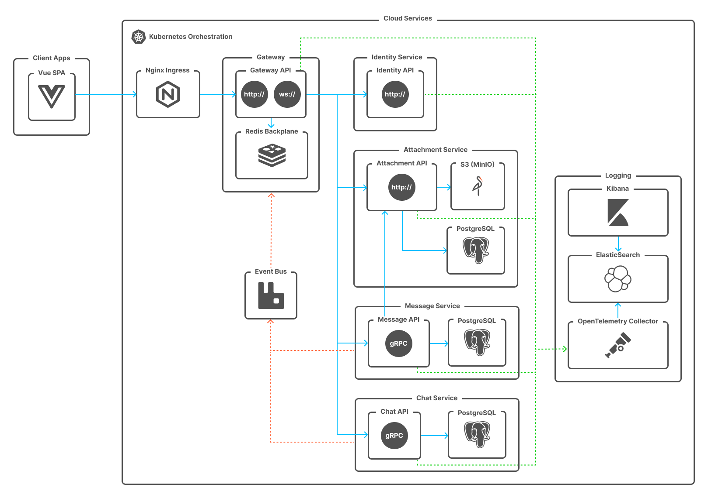

# QuickChat

QuickChat is a demo project that demonstrates building a simple real-time chat application with modern distributed system practices.
It allows users to create chat rooms in one click without registration and share text or files between people or devices.

## Architecture

The project is designed with **Domain-Driven Design (DDD)** and **CQRS** principles.  
It follows a microservices architecture with asynchronous communication and centralized logging.

### Key Components
- **ASP.NET Core Microservices** – backend services implementing DDD and CQRS patterns
- **RabbitMQ** – message broker for event-driven communication
- **ELK Stack (Elasticsearch, OpenTelemetry collector, Kibana)** – centralized logging and monitoring
- **Kubernetes (k8s)** – container orchestration and deployment
- **gRPC / REST / SignalR** – service communication and API layer

### Features
- One-click chat creation (no registration required)
- Share text or files between devices
- Real-time message delivery via message bus and SignalR
- Distributed logging and monitoring
- Scalable and fault-tolerant deployment on Kubernetes
