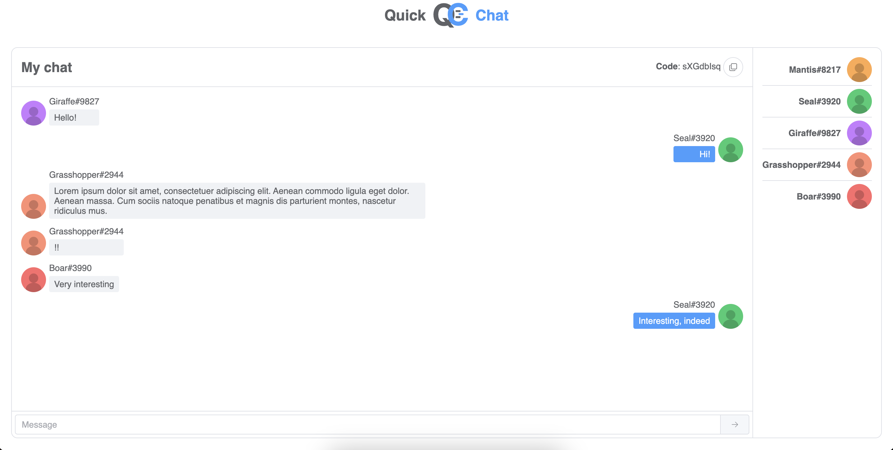

# QuickChat

**Share text & files instantly — no registration.**  
QuickChat is a web app that lets people create ephemeral chats and join them by short code or link. Designed for quick device-to-device or person-to-person transfers, it’s ideal for sharing snippets, screenshots, and files during meetings, workshops, or between your own devices.

---

## Highlights

- Create a chat room instantly — no signup required.
- Join via short code or one-click link.
- Share text, images, and files between devices or teammates.
- Ephemeral by design — keep things transient and simple.
- Built as scalable microservices with full telemetry and CI.

---

## Architecture

Overview of QuickChat’s architecture, showing components, communication, and infrastructure:


### Key Components

- **Backend:** ASP.NET Core microservices using DDD + CQRS
- **Client:** Vue.js single-page application  
- **Communication:** gRPC for internal services, REST for public APIs, SignalR (WebSocket) for live chat updates
- **Messaging & Events:** RabbitMQ for service events, Redis Pub/Sub for SignalR backplane
- **Storage:** PostgreSQL for relational data, MinIO for files and objects
- **Observability:** OpenTelemetry -> Collector -> Elasticsearch -> Kibana for logs and tracing
- **Deployment:** Docker + Kubernetes
- **Testing & CI:** xUnit tests with GitHub Actions on push & pull requests

---

## Screenshots

Home page and in-chat screenshots:

  


---

## Quickstart — run locally

> These steps assume you have Docker & k8s (kubectl) installed (or you can run each service individually).

1. Clone the repo:
```bash
git clone https://github.com/<your-org>/QuickChat.git
cd QuickChat
```

2. Install kubectl dependencies
```bash
kubectl create -f https://download.elastic.co/downloads/eck/3.1.0/crds.yaml
kubectl apply -f https://download.elastic.co/downloads/eck/3.1.0/operator.yaml
kubectl apply -f https://raw.githubusercontent.com/kubernetes/ingress-nginx/controller-v1.13.2/deploy/static/provider/cloud/deploy.yaml
```

3. Apply all pods
```bash
kubectl apply -f deployment --recursive
```
